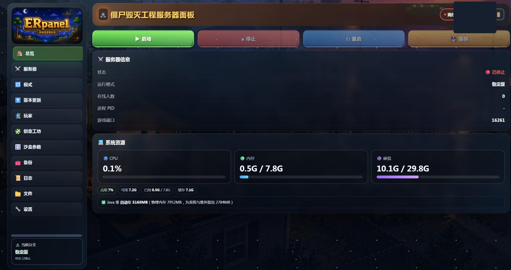
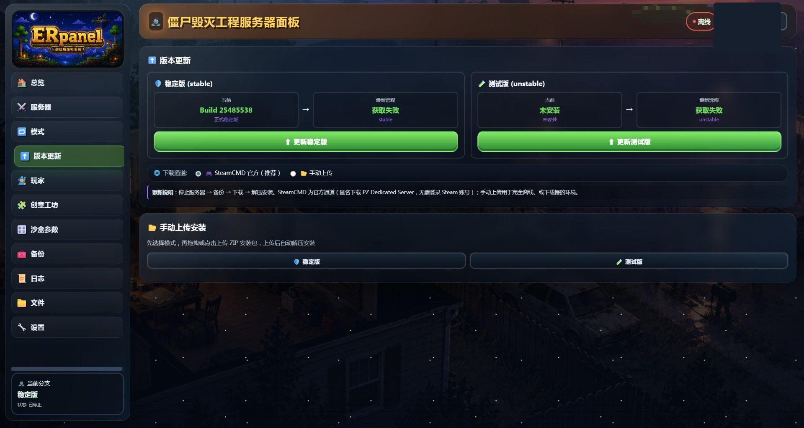
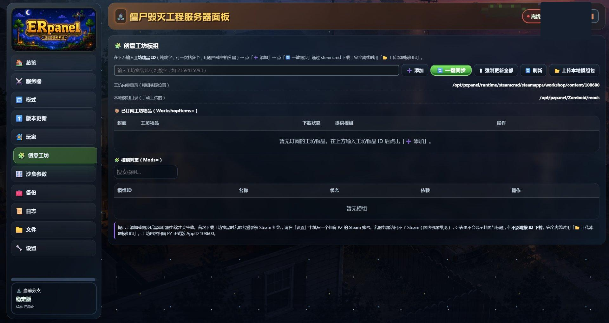
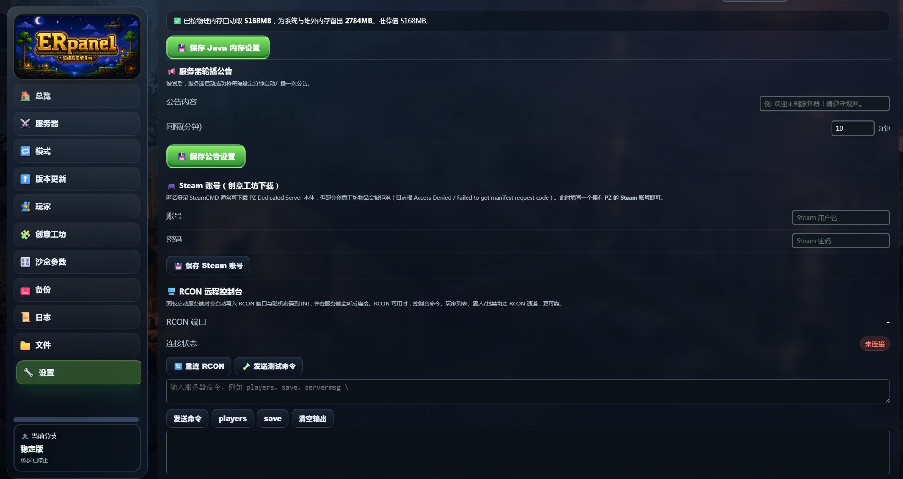
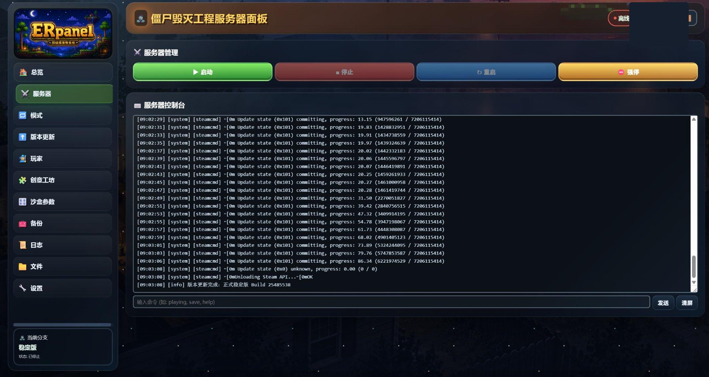

# PZPanel

《Project Zomboid》（僵尸毁灭工程）Dedicated Server 的 Linux 管理面板。

浏览器打开一个网页就能启停服务器、改 150 多项服务端配置、管创意工坊模组、看实时控制台、
用 RCON 下发命令、看性能曲线。不需要 SSH 敲命令，也不需要自己装 Java、steamcmd、systemd。

总览页：启停、运行状态、资源占用与游戏端口



## 为什么写它

PZ 的服务端管理目前基本停留在「手工运维」阶段：装 steamcmd、装 Java 17、编 ini、
写 systemd、盯日志。任何一个环节配错，表现出来的都是一句没有信息量的报错。

面板的价值不在这层封装，而在于它得知道 PZ 到底怎么工作 —— ini 里哪些键是生效的、
Java 堆该给多少、RCON 什么时候才能连上。下面几条是我在做的过程中真实踩到的坑，
也是这个面板和「套个 Web 壳」之间真正的差别。

## 那些文档上查不到、只能自己发现的坑

### 服务端「突然消失」不是崩溃，是被内核杀了

游戏跑到一半进程不见了，控制台日志也没有任何报错。这不是游戏自己退的，是内核的
OOM killer 干的。

根因在 Java 堆上限。早期的安装脚本按「物理内存减去 2GB」算堆，16GB 的机器上算出
13955MB —— 占物理内存的 87%。PZ B42 的堆外内存（地图与区块的流式加载）也吃内存，
堆给太多，内核就只能在 OOM 时杀掉整个进程，而这时 JVM 连一行日志都来不及打。

现在堆上限按物理内存自动推导：约 65%，至少给 OS 和 page cache 留够 1536MB，
按 4MB 对齐，最低 1024MB。关键是这个值不能再写死 —— 面板会被装到 4G/8G/16G/32G
各种机器上，任何硬编码都会在某一档上出错。所以 state.json 里存的是哨兵值 `0`
表示「自动」，面板启动时按**当时的**物理内存算，而不是按安装时算。

### 改配置「点了保存但没反应」

面板读 ini 的键名和 PZ 实际使用的键名不一致。比如游戏端口，ini 里叫 `DefaultPort`，
不叫 `port`；RCON 是全大写的 `RCONPort` / `RCONPassword`。这个错误很隐蔽：面板读不到
就会回退到自己 state.json 里的旧值，于是用户改了文件里的值，启动时面板又用自己的参数
覆盖回去。现象就是「改了什么都没用」。

更麻烦的是，启动时面板会传 `-port` / `-udpport` 命令行参数，而**命令行参数的优先级高于
ini**。读错键名的后果是：面板回退到自己 state.json 里的旧值，
用户的修改在启动时被面板自己的参数原样盖回去。

### 配置「保存一下注释全没了」

`_SandboxVars.lua` 是 Lua 文件，1020 行里有 738 行是注释（各种取��范围说明）。
最初的实现是「解析 → 改 → 重建整份文件」，结果实测把 1020 行重写成 282 行、
44513 字节缩成 7624 字节 —— 所有注释被销毁。PZ 不会报错，玩家下次开服才发现参数说明没了。

现在的做法是解析时记录每个叶子字段值的**字符区间**，保存时只替换变化的那几个值，
没变的地方逐字节不动；只有字段有增删时才回退到全量重建，并且会明确告知。

这套「保真写入」的原则后来推广到了所有配置写入上：改动 ini 的代码必须带写入护栏，
新内容字节数少于原文 70% 就拒绝落盘。配置被毁是不可逆事故。

### 内存占用显示 8G，其实只用了 615MB

Linux 上算内存占用很容易踩 `total - free`，但那个减法把 page cache 也算成了占用。
一台空载的 16GB 机器会显示「占用 8G」，而面板进程自己的 RSS 其实只有 73MB。

正确做法是用 `MemAvailable`。同一台机器，旧算法 8G+，新算法 615MB。

### 告警队列里的告警永远弹不出来

面板有一条前端队列，告警先进队列再依次弹窗展示。我加的全局去重集合在**入队**的时候
就把告警标记成「看过了」，结果**出队展示**时又被自己的去重挡掉 —— 排在后面的告警
永远不显示。

修的时候要把「入队」和「出栈展示」当成两条路径，前者标记已读但要放行自己这一条。

## 自建的验证链

这个项目没有浏览器自动化环境，所以验证全部落在 Node 脚本上，一共 10 个套件 495 项断言。
比较值得一提的几个：

**真正执行启动路径**。构造临时目录、伪造可执行文件，实际调 `_startPZ`，
然后把拼出来的命令行参数逐项断言。有一段血泪教训：改了个变量名
漏改引用，用户点启动直接失败，而当时三套测试全绿 —— 因为**没有任何一个测试真正走过
启动路径**。后来所有启动相关改动都必须跑这个套件。

**用假文件跑完整的打包流程**。转存脚本那个端到端自检用一堆假的小文件把流程走一遍
（打包、生成清单、二次运行、站点隔离校验），秒级完成。它抓出了两个真 bug，其中一个
是「清单里写的是 `"buildid": "x"`（带空格），判断语句找的是 `"buildid":"x"`（无空格）」，
导致跳过打包的逻辑永远不命中，每天白重打 3GB 而没有任何报错。

**校验脚本自己必须先证明会失败**。全部绿灯可能只是检查压根没触发。所以每次新增
校验逻辑，都会故意注入违规内容（比如塞一个真实域名进去）确认能被抓出来。

**删功能也要有契约**。砍掉一条产品线之后，专门写了一组断言守着「不许复活」：
后端没有残留分支、前端没有残留入口、脚本文件确实不存在、文档已同步；
同时断言**剩下的通道仍然完好**，避免删着删着把正常功能也带走了。

## 界面

版本管理：stable / unstable 双分支，SteamCMD 官方与手动上传两条通道



创意工坊：按工坊 ID 添加、steamcmd 一键同步，区分「已订阅工坊物品」与
「已加载 Mod」两张表



服务端配置：Java 堆上限、公告、Steam 账号、RCON 远程控制台



服务器页：启停 / 重启 / 强停，以及实时控制台（下面是 steamcmd 增量下载 PZ
服务端的真实输出）



## 架构

Node.js + Express 5 + WebSocket，单端口（3001）。前端是单文件 SPA，没有构建步骤 ——
改完刷新就是最新的，构建链本身不会成为故障源。

配置写入统一走一个网关层，把面板自己的字段和 PZ 的 ini 字段做**显式白名单映射**。
历史上手抖写过 `Object.assign(state, ini)`，后果是 150 个 ini 键名混进 state、
RCON 密码明文落盘。现在 `state.json` 只存白名单字段，密码的唯一真源是 ini。

沙盒参数、创意工坊、服务端配置三处的字段含义并不一致（比如 `Map` 在 ini 里是
地图名字符串，在 Lua 里是嵌套表），比较时必须按类型区分，否则会误报冲突。

## 安装

Ubuntu 22.04 / Debian / CentOS / Rocky。需要 root。

```bash
tar -xzf pzpanel-1.0.0.tar.gz
cd pzpanel-1.0.0
sudo bash scripts/install.sh
```

脚本会定向安装 Java 17（PZ B42 的硬性要求，Ubuntu 22.04 的 `default-jre` 是
Java 11，装了开服直接失败）、Node.js 20、steamcmd，建 `pzpanel` 系统用户，
生成 systemd 服务并开机自启，最后做端口与健康检查。面板进程本身以非特权用户运行，
避免 PZ 以 root 身份写存档。

装完浏览器打开 `http://服务器IP:3001`，最先注册的账号即为管理员。

需要放行的端口：`3001/tcp`（面板）、`16261-16262/udp`（游戏）。

## 一个部署环境相关的坑

如果部署目标是 **Anolis / Alibaba Cloud Linux**，面板能装起来，但
**「版本管理」里无法自动下载服务端**，只能走「手动上传」通道。

原因是 steamcmd 是 32 位程序，而这类系统官方明确不提供 i686 软件包
（文档原话 "Anolis OS does not provide i686 packages"）。报错极具误导性：

```
steamcmd.sh: line 37: .../linux32/steamcmd: No such file or directory
```

文件其实在（4.8MB）。内核找不到的是 32 位动态链接器 `/lib/ld-linux.so.2`，
而这个错误报的是 steamcmd 自己的路径，看起来像「压缩包没解压全」。

我一开始把两套系统的安装命令并列写在文档里，结果有人在 CentOS 上照着 `apt-get`
那条敲，得到 `command not found`。现在脚本会自己识别发行版，并且明确告诉你这台机器
走不通哪条路、该换哪条。绝对不要为了绕过它去装其它发行版的 `glibc.rpm` ——
glibc 是核心库，版本错配会直接搞坏系统。

## 常用操作

```bash
systemctl status pzpanel      # 状态
systemctl restart pzpanel     # 重启
journalctl -u pzpanel -f      # 实时日志（出问题时先看这个）
curl localhost:3001/health
```

卸载：`sudo bash scripts/uninstall.sh`（保留服务端二进制、存档与备份）。

## 说明

本仓库只放展示材料，**不包含源码**。这是一个非商业的个人项目，游戏本身与
Project Zomboid 版权归 The Indie Stone 所有。

## License

保留所有权利。